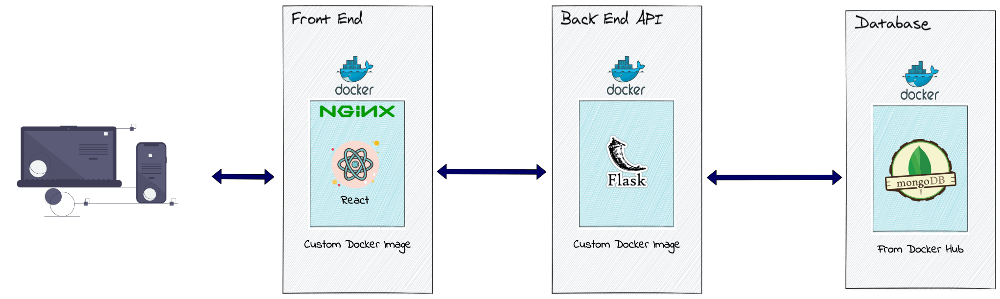
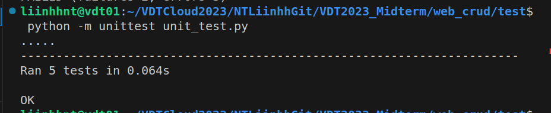
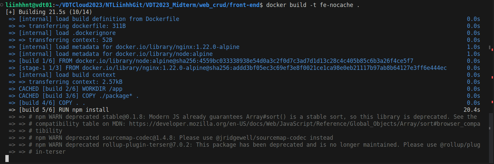
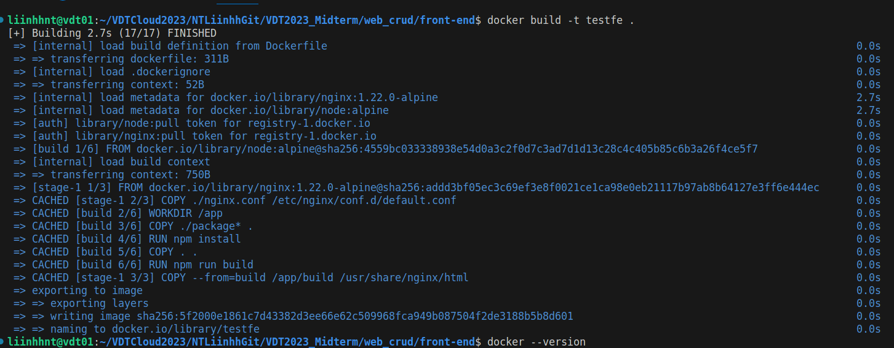
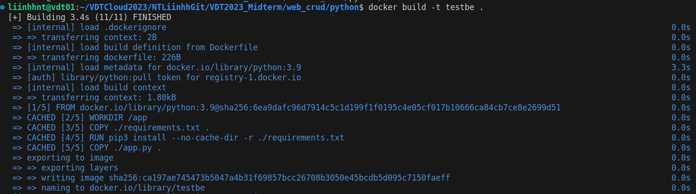
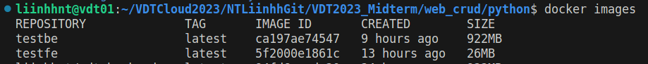
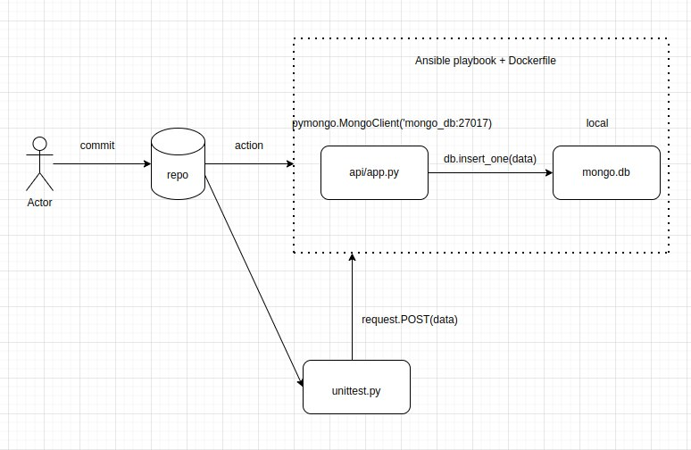
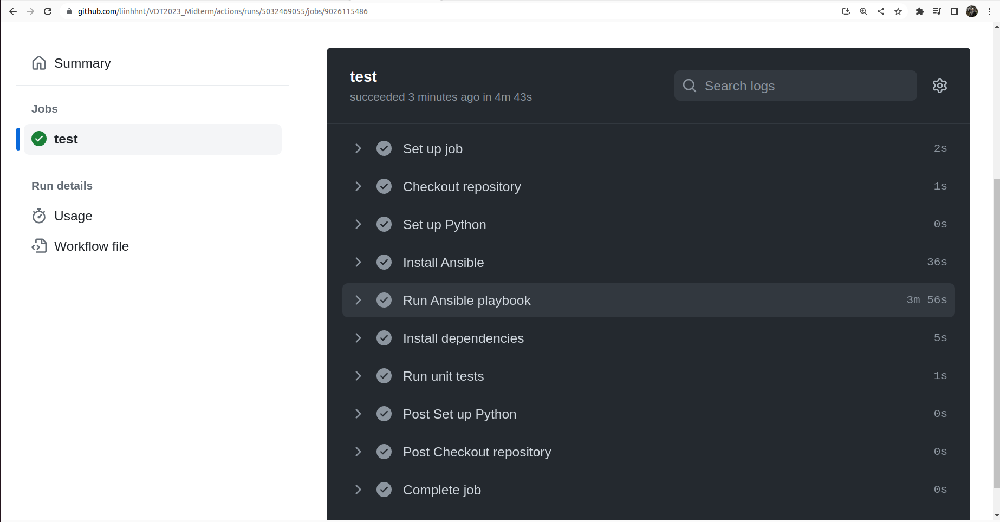
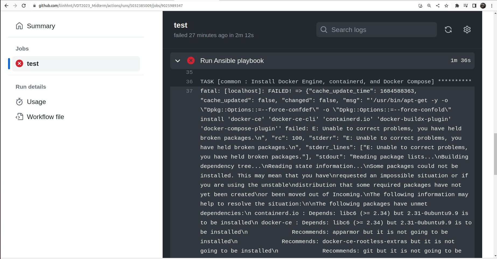

# Midterm Project <!-- omit in toc -->

Author: **Nguyen Thi Linh**

## Table of Contents <!-- omit in toc -->

- [0. Build a 3-tier web application](#1-build-a-3-tier-web-application)
- [1. Containerization](#1-containerization)
- [2. Continuous Integration](#2-continuous-integration)
- [3. Continuous Delivery ](#3-continuous-delivery)
- [4. Monitoring](#4-monitoring)
- [5. Logging](#5-logging)
- [6. Result and Conclusion](#6-result-and-conclusion)
- [7. References](#7-references)

## 0. Build a 3-tier web application
### Requirements
- Viết một CRUD web application đơn giản thực hiện các chức năng:
  - Liệt kê danh sách sinh viên tham gia khóa đào tạo chương trình VDT 2023 lĩnh
  vực cloud dưới dạng bảng (0.5đ)
  - Cho phép xem chi tiết/thêm/xóa/cập nhật thông tin sinh viên (0.5đ)
- Thiết kế hệ thống với ba dịch vụ: (0.5đ)
  - web: Giao diện web viết bằng HTML + CSS + Javascript được triển khai trên nền
  web server nginx
  - api: RESTful API viết bằng ngôn ngữ lập trình tùy chọn (prefer Python), có đầy
  đủ các chức năng: list, get, create, update, delete các bản ghi thông tin sinh viên
  - db: Database SQL hoặc NoSQL lưu trữ thông tin sinh viên (dữ liệu khởi tạo của
  DB này được cho bởi bảng trong Phụ lục I.)
- Viết unit tests cho các chức năng APIs (0.5đ)

### Output

- Web application architecture:
  

- The source code is contained in the [web_crud](/web_crud) directory, including 3 services:
  - [front-end](/web_crud/front-end): contains the code for the interface, written in React.js and deployed on the web nginx server
  - [python](/web_crud/python): Resful API written in Flask framework. Includes APIs:
    - List all attendees (GET): 
      `http://localhost:5000/api/attendees`
    - Get information of a certain attendee (GET): 
      `http://localhost:5000/api/attendees/getone/<id>`
    - Create new attendee (POST): 
      `http://localhost:5000/api/attendees`
    - Update attendees (PUT): 
      `http://localhost:5000/api/attendees/<id>`
    - Delete attendees (DELETE): 
      `http://localhost:5000/api/attendees/<id>`
  - [mongodb](/web_crud/mongodb): NoSQL stores data of student information. Initialization data is stored in the file [attendees.csv](/web_crud/mongodb/attendees.csv), which is initialized via the command in the [init.sh](/web_crud/mongodb/init.sh) file

- Unit test API (source code can be found in [here](/web_crud/test/)):
  - I use `unittest` library of Flask to send requests.
  - Because of time limit, I have not created virtual database for test yet, so I use original database. To avoid modifying the DB, and ensuring that the APIs are testable independently of each other, I use the `Setup` function to create an instance model. After executing API test, `tearDown` function will automatically be called to delete these instances
  - To run unittest, use command: 
    ```shell
    python -m unittest unit_test.py
    ```
    Result: 
   

## 1. Containerization

### Requirements
- Viết Dockerfile để đóng gói các dịch vụ trên thành các container image (0.5đ)
- Yêu cầu image đảm bảo tối ưu thời gian build và kích thước chiếm dụng, khuyến khích sử dụng các thủ thuật build image đã được giới thiệu (layer-caching, optimized RUN instructions, multi-stage build, etc.) (0.5đ)

### Output
- Dockerfile:
  - [frontend](/web_crud/front-end/Dockerfile)
  Build command:
    ```shell
    docker build -t fe .
    ```
  - [backend](web_crud/python/Dockerfile)
  Build command:
    ```shell
    docker build -t be .
    ```

- Technique use:

  - Use image base `alpine` to minimize image size

  - Docker layer caching:

    Example: Dockerfile of front-end + Nginx server:
    ```yml
    FROM node:alpine as build
    WORKDIR /app
    COPY ./package* .
    RUN npm install
    COPY . .
    RUN npm run build

    FROM nginx:1.22.0-alpine
    COPY ./nginx.conf /etc/nginx/conf.d/default.conf
    COPY --from=build /app/build /usr/share/nginx/html
    EXPOSE 80
    CMD ["nginx", "-g", "daemon off;"]
    ```
    By default, if we don't say anything, Docker will automatically look in the cache and during the build image, Docker will compare the cache with the Dockerfile and if there is a change at any layer then it won't cached again.

    In this project, because when we edit the code, layer `COPY . .` changed, so from then on it is no longer cached and the build image takes a long time.

    

    So if we arrange the components that change rarely (`npm install`) to the top and the components that change frequently (`COPY . .`) to the bottom, then the image build process will be significantly reduced.
    
    - Output build front-end image:
    

    - Output build back-end image:
    

  - Multi-stage build
    - Since nginx serve only static files, we need to build the data to render to the web first, by copying the necessary file (package, src, public...)
    - But in the end, we only need to use the built information in the `app/build` directory, without other files (package, src, public...)
      ```yml
      COPY --from=build /app/build /usr/share/nginx/html
      ```
    - By using multi-stage build, we only need one Dockerfile to optimize the image size. The final image contains only what is needed to run the application, minimizing the size compared to using two separate Dockerfiles.

    - Docker images size:
    

## 2. Continuous Integration
### Requirements
- Tự động chạy unit test khi tạo PR vào branch main (0.5đ)
- Tự động chạy unit test khi push commit lên một branch (0.5đ)
### Output
- File set up công cụ CI: [ci.yaml](.github/workflows/ci.yaml)
  As I mentioned above, I have not mock database. So I must to run ansible-playbook first, to create database and server containers. My workflow is something like this:
 

- Demo CI successfully:

- Output log: [log-ci.zip](output/logs/log-ci.zip)
- Total time: approx 5 minutes

- I recognize that when CI, I must run 2 steps: install ansible and run ansible-playbook. They take a long time (and resource, maybe). I try to run Ansible Playbook by Docker container follow [this tutorial](https://github.com/marketplace/actions/run-your-ansible-playbook-in-a-docker-container), but it failed. After debugging so much, I recognize that this tutorial so out of date.  It uses out-dated ubuntu base and consequently, I got error at step install Docker:


 - I found [another tutorial](https://github.com/marketplace/actions/run-ansible-playbook), still aiming to remove the "install ansible" step. And it seems to work better when the CI time has been reduced significantly (about 3 minutes)
 
 Output log: [logs_ci_2.zip](output/log2/logs_ci_2/zip)


